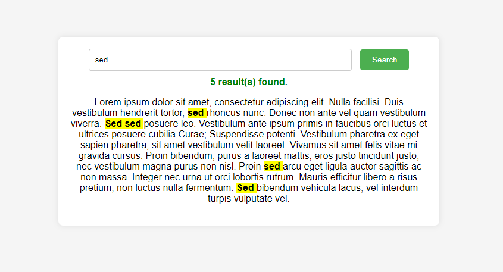

# Search Text Highlighter

This is a simple web application that allows users to search for specific text within a paragraph and highlights all occurrences of the searched text.

## Features

- Input field to enter the text you want to search for.
- Clickable button to initiate the search.
- Automatic highlighting of all matches within the paragraph.
- Display of the number of matches found.
- Feedback message indicating whether any results were found.

## Instructions

1. Enter the text you want to search for in the input field labeled "Search...".
2. Click the "Search" button to initiate the search.
3. Matches will be highlighted in yellow within the paragraph.
4. The number of matches found will be displayed above the paragraph.
5. If no matches are found, a message in red will indicate this.

## How It Works

- The application uses JavaScript to perform a search within the paragraph element.
- It utilizes regular expressions to find all occurrences of the searched text, ignoring case sensitivity.
- Matches are then highlighted using HTML `<mark>` tags.
- The application provides visual feedback to the user based on the search results.

## Technologies Used

- HTML
- CSS
- JavaScript

## How to Run

### Option 1: Download ZIP

1. Download the ZIP file from the [GitHub repository](https://github.com/0xelsherif/Search-Text-Highlighter).
2. Extract the ZIP file to your desired location.
3. Open the extracted folder.
4. Double-click the `index.html` file to open it in a web browser.

### Option 2: Clone the Repository

1. Clone the repository using the following command in your terminal or command prompt:
``` 
git clone https://github.com/0xelsherif/Search-Text-Highlighter.git 
```
2. Navigate to the cloned directory:
``` 
cd Search-Text-Highlighter
```
3. Open the `index.html` file in a web browser.

## Preview



## Support and Contributions

If you find this project useful or interesting, consider giving it a star ⭐ on GitHub and spreading the word! Your support means a lot to me and helps in maintaining and improving the project.

If you'd like to contribute to the project, whether it's fixing bugs, adding new features, or improving documentation, feel free to open a pull request. Contributions of all kinds are welcome!

## Follow Me

Follow me on GitHub to stay updated with my latest projects and contributions:

[](https://github.com/0xelsherif)

### Buy Me a Coffee ☕

If you'd like to support the development of this project further or express your appreciation with a small gesture, consider buying me a coffee! Your support helps keep me fueled for more coding sessions. Thank you for your support! 

[](https://www.buymeacoffee.com/0xelsherif)
